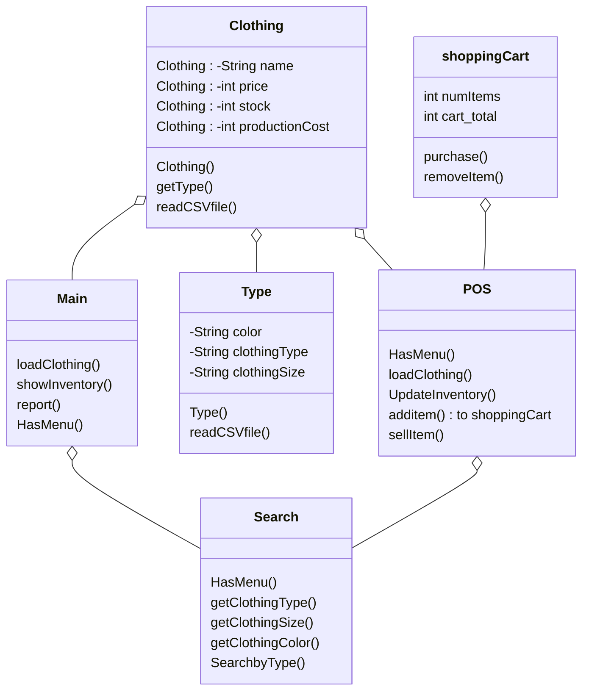

```mermaid
classDiagram
    Main o-- Search
    class Main{
        loadClothing()
        showInventory()
        report()
        HasMenu()
    }
    Clothing o-- Main
    Clothing o-- Type
    class Clothing{
        Clothing : -String name
        Clothing : -int price
        Clothing : -int stock
        Clothing : -int productionCost
    
        Clothing()
        getType()
        readCSVfile()
    }
    class Type{
        -String color
        -String clothingType
        -String clothingSize
        Type()
        readCSVfile()
    }
    class Search{
        HasMenu()
        getClothingType()
        getClothingSize()
        getClothingColor()
        SearchbyType()

    }
    POS o-- Search
    Clothing o-- POS
    class POS {
        HasMenu()
        loadClothing()
        UpdateInventory()
        additem() to shoppingCart
        sellItem()

    }
shoppingCart o-- POS
class shoppingCart{
    int numItems
    int cart_total
    purchase()
    removeItem()

}


```
