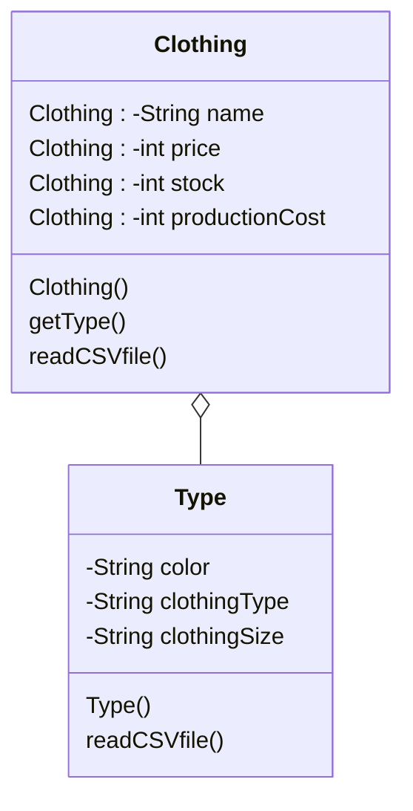

# Final_Project_CS121

```mermaid
classDiagram
    Clothing o-- Type
    class Clothing{
        Clothing : -String name
        Clothing : -int price
        Clothing : -int stock
        Clothing : -int productionCost
    
        Clothing()
        getType()
        readCSVfile()
    }
    class Type{
        -String color
        -String clothingType
        -String clothingSize
        Type()
        readCSVfile()
    }


```
