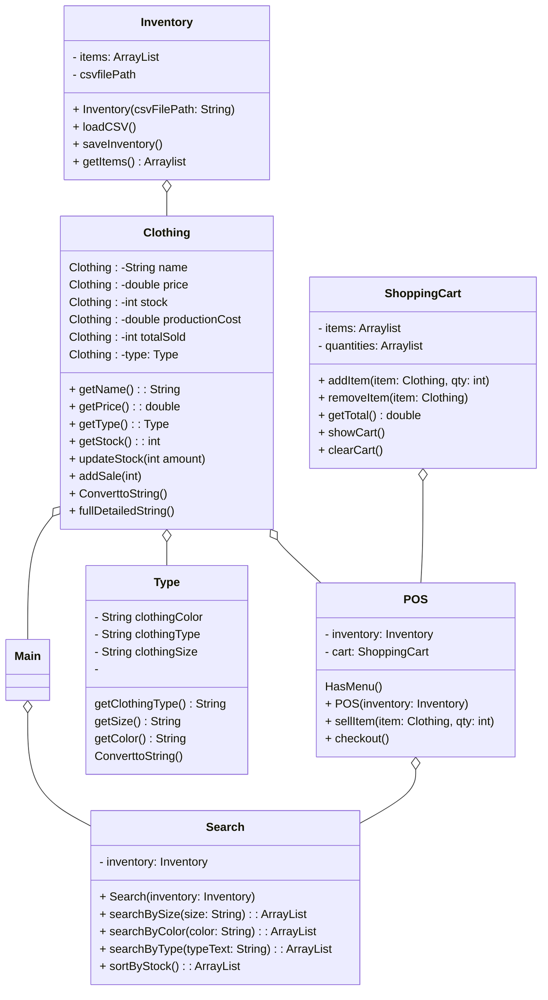

# Clothing and Type class 
    load Inventory from CSV file
    For each line in CSV:
        Parse name, type, size, color, stock, price, production cost
        
# public interface HasMenu 
    String Menu();
    void start();

# Main
if user input = 0 
else if input = 1
              = 2
else: try again! 0- #
## loadClothing()
    pull from csv file
    use this example:
    https://github.com/twopiharris/BSU-CS121/blob/main/java_data/%23ReadFile.java%23

## int Menu()
    ---------------------
    0) Inventory
    1) Report
    2) Start POS System
    ---------------------
    return int input
    
## showInventory()
    simply print out inventory
    for number of lines in csv file
    System.out.println()

## report()
    take each item's amount sold variable
    print the name, amount sold, and amount sold x item price.
    
    

