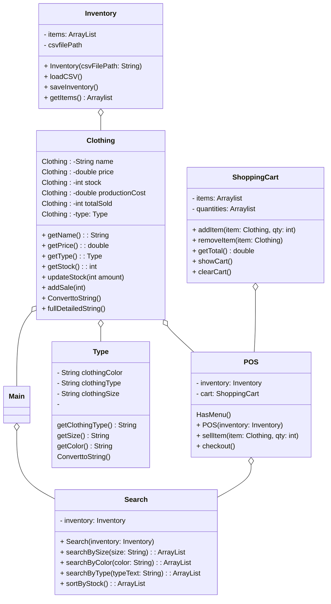

# Main.cpp
    inventory = new Inventory("inventory.csv")
    pos = new POS(inventory)
    pos.Menu()

# Class Type
    private clothingType
    private size
    private color

    Contructor Type(typeText, sizeText, colorText)
        clothingType = typeText
        size = sizeText
        color = colorText

    getClothingType()
        return clothingType
    
    getSize()
        return size

    getColor()
        return color

    convertToString()
        return clothingType + "/" + size + "/" + color "/"

# Clothing class

    PRIVATE name
    PRIVATE price
    PRIVATE stock
    PRIVATE productionCost
    PRIVATE totalSold
    PRIVATE type 
    
   constructor Clothing(name, price, stock, cost, typeObject)
    this.name = name
        this.price = price
        this.stock = stock
        this.productionCost = cost
        this.totalSold = 0
        this.type = typeObject
    
    getName()
        return name 
    getPrice()
        return price
    getStock()
        return price
    getType()
        return type
    updateStock(amount)
        stock = stock + amount
    addSale(qty)
        totalSold = totalSold + qty
        stock = stock - qty
    convertToString()
        return name + " | " + type.convertToString() + " | Stock: " + stock
    fullDetailedString()
        return "Name: " + name +
               "\nType: " + type.toString() +
               "\nPrice: " + price +
               "\nStock: " + stock +
               "\nProduction Cost: " + productionCost +
               "\nTotal Sold: " + totalSold

# Class Inventory
    Private items ArrayList of clothing
    Private filePath

    constucter Inventory(path)
    filePath = path
        items = EMPTY LIST
        loadCSV()

    loadCSV()
         OPEN file using filePath
        FOR each line in file:
            READ name, type, size, color, stock, price, cost
            newType = new Type(type, size, color)
            newClothing = new Clothing(name, price, stock, cost, newType)
            ADD newClothing to items
        CLOSE FILE

    saveInventory()
     OPEN file at filePath
        FOR each clothing in items:
            WRITE clothing data back to file
    Close file

    getItems()
        return items

# Class Search
    Private inventory (object)

    inventory = inventoryObject

    searchBySize(sizeText)
        results = EMPTY LIST
        FOR each item in inventory.getItems():
            IF item.getType().getSize() == sizeText:
                ADD item to results
        end FOR
        return results

    searchByColor(colorText)
        results = EMPTY LIST
        FOR each item in inventory.getItems():
            IF item.getType().getColor() == colorText:
                ADD item to results
        end FOR
        return results

    searchByType(typeText)
        results = EMPTY LIST
        FOR each item in inventory.getItems():
            IF item.getType().getClothingType() == typeText:
                ADD item to results
        end FOR
        return results

# Class ShoppingCart
    private items   list of Clothing
    private quantities  list of Integers matching items

    CONSTRUCTOR ShoppingCart()
        items = empty list
        quantities = empty list

    addItem(item, qty)
        add item to items
        add qty to quantities
    
    removeItem(item)
        find index of item in items
        remove item at that index
        remove quantity at that index

    showCart()
        for i from 0 to size of items:
            print items[i].getName() + " x" + quantities[i]

    getTotal()
        total = 0
        for i from 0 to size of items:
            total = total + (items[i].getPrice() * quantities[i])
        end for
    return total

    clearCart()
        CLEAR items
        CLEAR quantities

# Class POS
     PRIVATE inventory     Inventory object
    PRIVATE cart           ShoppingCart object
    PRIVATE search         Search object

    
Constructor POS(inv)
        inventory = inv
        cart = new ShoppingCart()
        search = new Search(inv)

        showMenu()
        while keepGoing:
            PRINT "1. Search for item"
            PRINT "2. View cart"
            PRINT "3. Checkout"
            PRINT "4. Exit"

            input choice

            if choice == 1:
                 searchMenu()
            else if choice == 2:
                 cart.showCart()
            else if choice == 3:
                 checkout()
            else if choice == 4:
                break loop
                keepGoing = false

        searchMenu()
            print search options (size, color, type)
            get user input
            call appropriate search function
            display results
            user pick an item and quantity
            cart.addItem(item, qty)

        checkout()
        total = cart.getTotal()
        print total
        for every item in cart:
            call item.addSale(quantity)
        end for
        inventory.saveInventory()
        cart.clearCart()    

