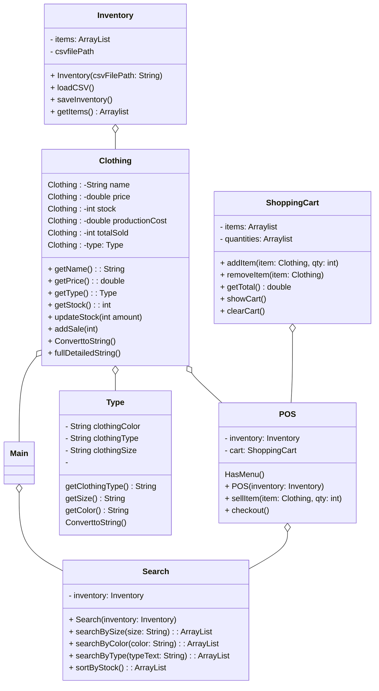

# Main.cpp
    inventory = new Inventory("inventory.csv")
    pos = new POS(inventory)
    pos.Menu()

# Class Type
    private clothingType
    private size
    private color

    Contructor Type(typeText, sizeText, colorText)
        clothingType = typeText
        size = sizeText
        color = colorText

    getClothingType()
        return clothingType
    
    getSize()
        return size

    getColor()
        return color

    convertToString()
        return clothingType + "/" + size + "/" + color "/"

#Clothing class

    PRIVATE name
    PRIVATE price
    PRIVATE stock
    PRIVATE productionCost
    PRIVATE totalSold
    PRIVATE type 
    
    

